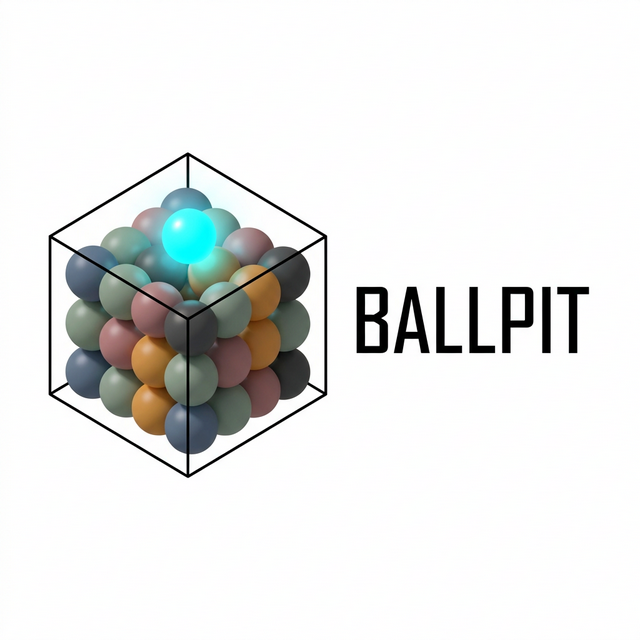
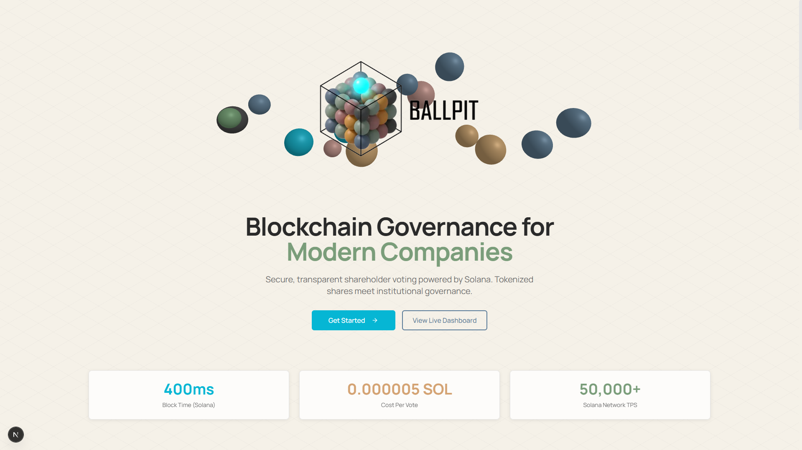
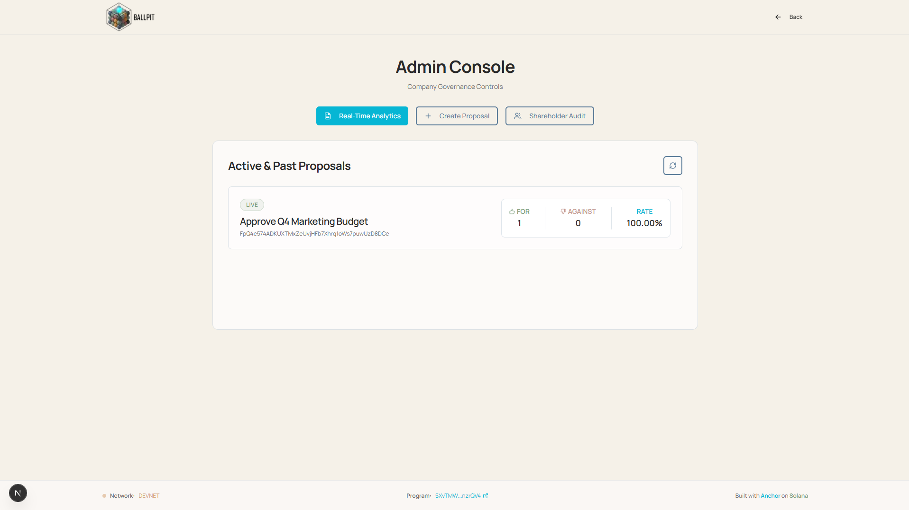
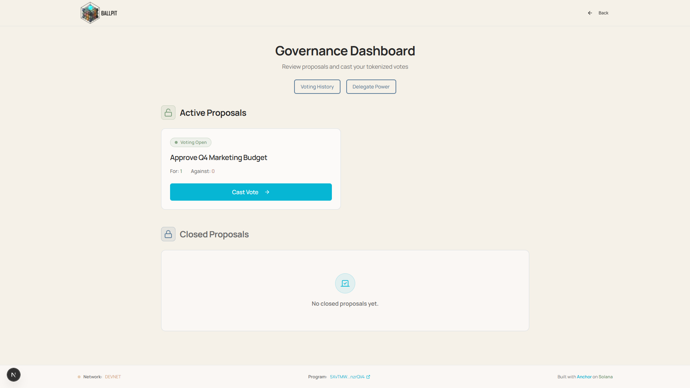
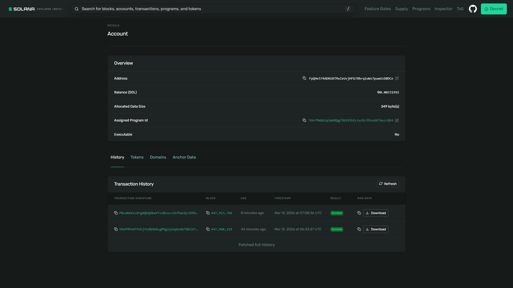

  

Ballpit is a blockchain-based shareholder voting platform that tokenizes corporate shares on Solana to enable secure, transparent, and immutable governance. It replaces traditional paper-based proxy voting with a hybrid architecture combining off-chain KYC verification with on-chain cryptographic audit trails.

### Research Context

Ballpit addresses well-documented challenges in traditional corporate governance systems where **[shareholder participation is low, proxy voting is opaque, and vote manipulation risks exist](https://stanford-jblp.pubpub.org/pub/blockchain-and-public-companies)**. Companies like **[Nasdaq](https://ir.nasdaq.com/news-releases/news-release-details/nasdaq-deliver-blockchain-e-voting-solution-strate)** and **[Corporify](https://en.wikipedia.org/wiki/Corporify)** have piloted blockchain voting solutions, but these systems remain costly, complex, and often require significant infrastructure investment.

### How Ballpit Works

Ballpit extends traditional corporate governance into a transparent, auditable system by leveraging an end-to-end KYC → Token Minting → On-Chain Voting pipeline:

1. **Identity Verification Layer (KYC Service)**
   Companies verify shareholder identities off-chain.
2. **Token Issuance Layer (SPL Token Minting)**
   Backend mints tokenized shares as SPL tokens on Solana (one token = one vote).
3. **Governance Layer (Anchor Smart Contract)**
   Shareholders vote on-chain via VoteAccounts (ballot boxes) with weighted voting and delegation.
4. **Audit Layer (Real Name Registry)**
   Off-chain mapping of wallet addresses to verified identities for compliance and audit trails.

  
<b>View Screenshots</b>

   

| Landing Page | Admin Dashboard | Voting Dashboard | Transaction Record |
| :---: | :---: | :---: | :---: |
|  |  |  |  |

## Key Features

- **Immutable Audit Trail**: Every vote is signed and recorded on Solana, creating a permanent, tamper-proof record.
- **Real-Time Finality**: Instant vote tallying and results via blockchain state updates (sub-second latency).
- **Proxy Delegation**: Cryptographically secured delegation chains allowing trustless proxy voting.
- **Double-Vote Protection**: Deterministic PDA seeds (Program Derived Addresses) prevent duplicate voting at the protocol level.
- **Cost Efficiency**: High-throughput voting at a fraction of the cost of traditional proxy services (~$0.000005/vote).

## Documentation

- **[SETUP.md](docs/SETUP.md)**: Environment configuration and installation.
- **[ARCHITECTURE.md](docs/ARCHITECTURE.md)**: System design and sequence diagrams.
- **[API.md](docs/API.md)**: REST API and Smart Contract specification.
- **[STYLE.md](docs/STYLE.md)**: Coding standards and project conventions.

## License

See **[LICENSE](LICENSE)** file for details.