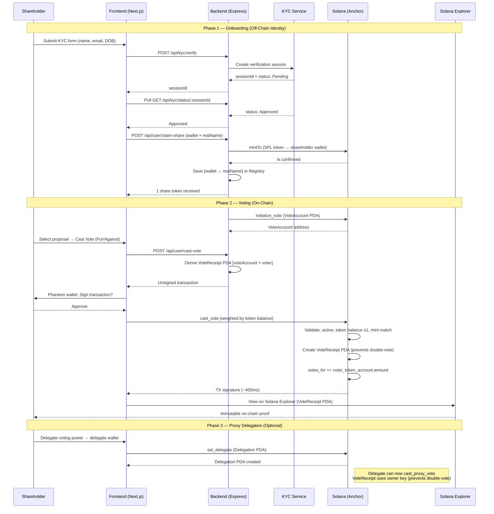

# Ballpit Architecture Documentation

This document provides detailed architectural documentation, design decisions, and a glossary of terms for the Ballpit blockchain-based shareholder voting system, which enables corporate governance through tokenized shares and on-chain voting on Solana.

## System Sequence Diagram




## Glossary of Terms

- **Tokenized Shares**: Digital representation of company shares minted as SPL tokens on Solana. Each token represents one voting unit and ownership stake.

- **KYC (Know Your Customer)**: Off-chain identity verification process that ensures only verified shareholders can receive tokenized shares and vote.

- **VoteAccount**: On-chain account (smart contract account) that stores vote proposal information, vote tallies, and voting status. Also referred to as the "Ballot Box."

- **VoteReceipt**: Program-derived address (PDA) that serves as proof a shareholder has voted on a specific proposal. Prevents double-voting.

- **Delegation**: Mechanism allowing token owners to delegate their voting rights to another address (delegate) who can vote on their behalf.

- **Delegation PDA**: Program-derived address storing delegation information, seeded by owner wallet and token mint.

- **Real Name Registry**: Off-chain database (lowdb) that maps wallet addresses to verified real names from KYC, enabling audit trails while maintaining on-chain privacy.

- **Authority Wallet**: Backend-controlled Solana wallet that mints tokens, creates votes, and manages company operations.

- **SPL Token**: Solana Program Library token standard used for tokenized shares.

- **Anchor Framework**: Development framework for Solana programs that provides type-safe interfaces and account management.

- **PDA (Program Derived Address)**: Deterministic address derived from seeds, allowing programs to control accounts without requiring a private key.


## Repository Structure

```
Ballpit/
├── backend/                        # Node.js/Express backend
│   ├── app.js                      # Express application configuration
│   ├── index.js                    # Server entry point and listener
│   ├── routes/                     # Modular API route handlers
│   │   ├── kycRoutes.js            # KYC endpoints
│   │   ├── companyRoutes.js        # Admin/Company endpoints
│   │   ├── userRoutes.js           # User/Shareholder endpoints
│   │   ├── analyticsRoutes.js      # Admin analytics endpoints
│   │   ├── schemas.js              # Zod validation schemas and middleware
│   │   └── middleware.js           # Security middleware (Admin/Validation)
│   ├── services/                   # Business logic and external services
│   │   ├── solanaService.js        # Centralized Solana/Anchor interaction
│   │   └── kycService.js           # Mock identity verification logic
│   ├── db.js                       # Real Name Registry database module (lowdb)
│   ├── idl.json                    # IDL copy for resilient loading
│   ├── tests/                      # Integration tests
│   │   └── api.test.js             # API endpoint tests
│   ├── e2e/                        # End-to-End tests
│   │   └── e2e.spec.js             # Playwright shareholder journey
│   ├── package.json                # Backend dependencies
│   └── .env                        # Environment variables (not in git)
│
├── frontend/                       # Next.js 16 (React 19)
│   ├── src/
│   │   └── app/
│   │       ├── page.tsx            # Main user interface
│   │       ├── layout.tsx         # Root layout
│   │       └── globals.css         # Global styles
│   ├── public/                     # Static assets
│   ├── package.json                # Frontend dependencies
│   └── next.config.ts              # Next.js configuration
│
├── voting_contract/                # Solana smart contract (Anchor/Rust)
│   ├── programs/
│   │   └── voting-contract/       # Program directory (hyphenated)
│   │       └── src/
│   │           └── lib.rs          # Main smart contract program
│   ├── tests/                      # Anchor test suite
│   │   └── voting-contract.ts      # Main test file
│   ├── Anchor.toml                 # Anchor configuration
│   ├── Cargo.toml                  # Rust workspace configuration
│   └── target/                     # Build artifacts (not in git)
│       └── idl/
│           └── voting_contract.json # Generated IDL
│
├── docs/                           # Documentation directory
│   ├── ARCHITECTURE.md             # This file
│   ├── API.md                      # API reference
│   ├── TESTING.md                  # Testing guidelines
│   └── STYLE.md                    # Coding standards
│
├── README.md                       # Project overview
└── SETUP.md                        # Setup instructions
```


## Technology Stack

| **Category**           | **Technology**            | **Purpose**                                             | **Rationale**                                                                                 |
| ---------------------- | ------------------------- | ------------------------------------------------------- | ---------------------------------------------------------------------------------------- |
| **Frontend Framework** | **Next.js 16**            | User interface (Dashboard, Voting Interface)           | App Router enables rapid development, SSR support, and optimized React 19 integration |
| **Styling**            | **Tailwind CSS**          | UI styling (Dark mode, responsive design)            | Rapid prototyping without custom CSS                                      |
| **Backend Framework**  | **Express.js**            | REST API server                                         | Lightweight, flexible, and well-suited for Solana integration                               |
| **Blockchain**         | **Solana**                | Smart contract platform                                 | High throughput, low fees, fast finality for governance applications                        |
| **Smart Contracts**    | **Anchor Framework**      | Solana program development                              | Type-safe interfaces, simplified account management, IDL generation                        |
| **Program Language**   | **Rust**                  | Smart contract implementation                           | Memory safety, performance, and Solana's native language                                   |
| **Token Standard**     | **SPL Token**             | Tokenized share representation                         | Standard Solana token format, compatible with wallets and exchanges                         |
| **KYC Service**        | **Mock KYC Service**     | Identity verification (Pre-approved)                   | Simplifies onboarding for MVP and evaluations             |
| **Database**           | **lowdb**                 | Real Name Registry (off-chain)                         | Lightweight JSON database for mapping wallets to verified names                            |
| **Blockchain SDK**     | **@solana/web3.js**       | Solana RPC interactions                                | Official Solana JavaScript SDK                                                              |
| **Anchor SDK**         | **@coral-xyz/anchor**     | Anchor program client                                  | Type-safe client for interacting with Anchor programs                                       |


## System Architecture

### High-Level Overview

Ballpit follows a three-tier architecture:

1. **Frontend Layer**: Next.js web application for user interaction
2. **Backend Layer**: Express.js API server handling business logic and Solana interactions
3. **Blockchain Layer**: Solana smart contracts for immutable vote recording

### Component Architecture

**Backend Server (`backend/`):**
- **Modular Routes**: Organized endpoints into functional areas:
  - `kycRoutes.js`: Handles mock verification sessions and status checks.
  - `companyRoutes.js`: Manages token creation, minting (including batch), and vote proposals.
  - `userRoutes.js`: Handles vote casting, delegation, and share claiming.
- **Solana Service**: Centralized Anchor program interaction and IDL loading logic in `solanaService.js`.
- **Hardening Middleware**:
  - `requestId`: Generates a unique `X-Request-ID` for every request.
  - `limiter`: Prevents API abuse via `express-rate-limit`.
  - `errorHandler`: Centrally maps all Solana and validation errors to professional JSON responses.
- **Environment Validation**: Ensures critical secrets (`PRIVATE_KEY`, `PROGRAM_ID`, etc.) are validated on startup.
- **Graceful Shutdown**: Listens for termination signals to close database and server connections cleanly.

**Real Name Registry (`backend/db.js`):**
- Stores wallet-to-name mappings using lowdb.
- Links verified KYC sessions to wallet addresses.
- Enables audit trails while maintaining on-chain privacy.

**Smart Contract (`voting_contract/programs/voting-contract/src/lib.rs`):**
- `initialize_vote`: Creates new vote proposals.
- `cast_vote`: Records shareholder votes.
- `cast_proxy_vote`: Records proxy votes via delegation.
- `set_delegate`: Establishes voting delegation.
- `revoke_delegation`: Removes delegation.
- `close_vote`: Closes voting and prevents new votes.

**Frontend (`frontend/src/app/`):**
- User interface for shareholders to view and cast votes.
- Company dashboard for creating proposals and viewing results.
- Wallet connection integration (Phantom, Solflare, etc.).
- Real-time vote result display.


## Data Flow

### Complete Governance Pipeline

**Overview:**
Ballpit's architecture separates identity verification (off-chain) from voting mechanics (on-chain). This design ensures privacy while maintaining compliance and auditability.

### Shareholder Onboarding Flow

**Frontend → Backend → KYC Service → Blockchain**

1. **KYC Initiation**: Shareholder requests KYC verification via `POST /api/kyc/verify` with wallet address
2. **Session Creation**: Backend creates mock KYC session with unique `sessionId` and returns verification URL
3. **Identity Verification**: Shareholder completes simulated KYC process (document upload, liveness check)
4. **Status Polling**: Frontend polls `GET /api/kyc/status/:sessionId` every 2-3 seconds for approval status
5. **Approval Event**: KYC service transitions session from `Pending` → `In_Progress` → `Approved`
6. **Share Claiming**: Upon `Approved` status, shareholder calls `POST /api/user/claim-share` with `walletAddress` and `realName`
7. **Token Minting**: Backend constructs `mintTo` SPL token instruction, signs with authority wallet, and mints 1 share token to shareholder's wallet
8. **Registry Update**: Backend saves `{ walletAddress, realName, sessionId }` mapping in Real Name Registry (lowdb)
9. **Onboarding Complete**: Shareholder can now participate in voting with tokenized share

### Vote Creation Flow

**Admin → Backend → Solana Smart Contract**

1. **Admin Authentication**: Company admin sends `POST /api/company/create-vote` with `x-admin-key` header and proposal `title`
2. **Account Generation**: Backend generates new keypair for VoteAccount (ballot box) using `Keypair.generate()`
3. **Transaction Building**: Backend constructs `initialize_vote` instruction with:
   - `voteAccount`: New keypair public key
   - `authority`: Backend wallet public key
   - `title`: Proposal title (e.g., "Q4 Board Election")
   - `tokenMint`: Share token mint address
4. **Transaction Signing**: Backend signs transaction with authority wallet and VoteAccount keypair
5. **Blockchain Submission**: Transaction sent to Solana RPC with `sendAndConfirmTransaction`
6. **On-Chain Storage**: VoteAccount created on-chain with initial state:
   ```rust
   VoteAccount {
       authority: <backend_wallet>,
       is_active: true,
       title: "Q4 Board Election",
       token_mint: <share_token_mint>,
       votes_for: 0,
       votes_against: 0,
   }
   ```
7. **Response**: Backend returns `{ voteAccount: "<public_key>", title: "...", requestId: "..." }`
8. **Proposal Visibility**: Vote appears in frontend shareholder dashboard for voting

### Vote Casting Flow

**Shareholder → Frontend → Backend → Smart Contract → Blockchain**

1. **Vote Selection**: Shareholder selects active proposal and direction (For/Against) in frontend UI
2. **Transaction Request**: Frontend calls `POST /api/user/cast-vote` with:
   - `voteAccount`: Public key of vote proposal
   - `voterWallet`: Shareholder's wallet address
   - `voteFor`: `true` (For) or `false` (Against)
3. **Account Derivation**: Backend derives VoteReceipt PDA address:
   ```javascript
   [voteAccount.publicKey, voterWallet.publicKey, Buffer.from("receipt")]
   ```
4. **Transaction Building**: Backend constructs `cast_vote` instruction with:
   - `voteAccount`: Vote proposal account
   - `voter`: Shareholder wallet (signer)
   - `tokenAccount`: Shareholder's share token account
   - `voteReceipt`: Derived PDA address
   - `voteFor`: Vote direction boolean
5. **Serialization**: Backend serializes transaction and returns to frontend
6. **Wallet Signing**: Frontend prompts shareholder to sign with Phantom/Solflare wallet
7. **Transaction Submission**: Signed transaction sent to Solana network
8. **Smart Contract Validation**: Anchor program executes `cast_vote` instruction and verifies:
   - Vote is active: `require!(vote_account.is_active, ErrorCode::VoteClosed)`
   - Voter has tokens: `require!(token_account.amount >= 1, ErrorCode::InsufficientShares)`
   - Token mint matches: `require!(token_account.mint == vote_account.token_mint, ErrorCode::InvalidMint)`
   - No double-voting: VoteReceipt PDA must not exist (creation fails if exists)
9. **Vote Recording**: Smart contract executes state changes:
   - Creates VoteReceipt PDA with `{ voter, vote_account, voted_for }`
   - Increments `vote_account.votes_for` or `vote_account.votes_against` by `token_account.amount`
10. **Confirmation**: Transaction confirmed in ~400-600ms on devnet
11. **Result Update**: Frontend fetches updated `VoteAccount` state from blockchain and displays new tallies

### Delegation Flow (Proxy Voting)

**Owner → Backend → Smart Contract (Delegation Setup)**

1. **Delegation Setup**: Token owner calls `POST /api/user/delegate` with:
   - `ownerWallet`: Owner's wallet address (signer)
   - `delegateWallet`: Delegate's wallet address
   - `tokenMint`: Share token mint address
2. **PDA Derivation**: Backend derives Delegation PDA address:
   ```javascript
   [ownerWallet.publicKey, tokenMint.publicKey, Buffer.from("delegation")]
   ```
3. **Transaction Building**: Backend constructs `set_delegate` instruction with derived PDA
4. **Owner Signing**: Frontend prompts owner to sign transaction authorizing delegation
5. **Delegation Record**: Smart contract creates/updates Delegation PDA:
   ```rust
   Delegation {
       owner: <owner_wallet>,
       delegate: <delegate_wallet>,
       mint: <token_mint>,
   }
   ```

**Delegate → Backend → Smart Contract (Proxy Vote Casting)**

6. **Proxy Vote Request**: Delegate calls `POST /api/user/cast-proxy-vote` with:
   - `voteAccount`: Vote proposal public key
   - `ownerWallet`: Original owner's wallet
   - `delegateWallet`: Delegate's wallet (signer)
   - `voteFor`: Vote direction
7. **Validation**: Backend verifies Delegation PDA exists and matches delegate
8. **VoteReceipt Derivation**: Uses **owner's wallet** for VoteReceipt PDA (not delegate's):
   ```javascript
   [voteAccount.publicKey, ownerWallet.publicKey, Buffer.from("receipt")]
   ```
9. **Transaction Signing**: Delegate signs transaction (not owner)
10. **Vote Recording**: Smart contract verifies delegation and records vote:
    - Checks `delegation.delegate == delegateWallet`
    - Uses `owner_token_account.amount` for vote weight
    - Creates VoteReceipt with `voter = ownerWallet` (prevents double-voting)
    - Increments vote tallies by owner's token balance
11. **Audit Trail**: VoteReceipt links to owner, Delegation PDA shows proxy chain

**Revocation:**

12. **Delegation Revocation**: Owner calls `POST /api/user/revoke-delegate`
13. **Account Closure**: Smart contract closes Delegation PDA and refunds rent to owner
14. **Effect**: Delegate can no longer vote on owner's behalf (validation fails)


## Design Decisions

### Off-Chain KYC, On-Chain Voting

**Decision**: KYC verification is handled off-chain via a mock verification service, while voting occurs on-chain via Solana smart contracts.

**Rationale**:
- KYC requires sensitive personal information that shouldn't be stored on-chain
- Mock KYC simplifies the onboarding flow for the MVP and evaluations
- On-chain voting provides immutability and transparency
- Real Name Registry bridges the gap for audit purposes while maintaining privacy

### Tokenized Shares as Voting Power

**Decision**: Each share token represents one voting unit, and vote weight equals token balance.

**Rationale**:
- Standard SPL tokens provide compatibility with Solana ecosystem
- Token balance automatically determines voting power
- Supports fractional ownership through token amounts
- Enables future features like token transfers and trading

### Program-Derived Addresses (PDAs) for VoteReceipts

**Decision**: VoteReceipts are PDAs seeded by vote account and voter address, preventing double-voting.

**Rationale**:
- PDAs are deterministic and cannot be created without program authority
- Seeding by vote and voter ensures uniqueness per vote-voter pair
- Prevents double-voting without requiring on-chain lookups
- Reduces storage costs compared to storing receipts in arrays

### Delegation via Separate PDA Accounts

**Decision**: Delegation records are stored in separate PDA accounts, allowing flexible proxy voting.

**Rationale**:
- Enables multi-level delegation chains
- Allows delegation revocation without affecting vote history
- Separates delegation logic from vote logic for clarity
- Supports future features like time-limited delegations

### Real Name Registry Off-Chain

**Decision**: Wallet-to-name mappings are stored in off-chain database (lowdb) rather than on-chain.

**Rationale**:
- Reduces on-chain storage costs
- Allows privacy-preserving on-chain voting
- Enables audit trails when needed (admin access)
- Simplifies GDPR compliance for personal data

### Express.js Backend Architecture

**Decision**: Backend uses Express.js with REST API endpoints rather than GraphQL or gRPC.

**Rationale**:
- Simple and familiar for Solana integration
- REST endpoints map cleanly to Solana transaction building
- Easy to integrate with frontend wallet libraries
- Sufficient for current feature set

### Anchor Framework for Smart Contracts

**Decision**: Smart contracts are built using Anchor framework rather than raw Solana programs.

**Rationale**:
- Type-safe interfaces reduce bugs
- IDL generation enables type-safe clients
- Simplified account management
- Better developer experience and faster iteration

### Hardened Error Mapping

**Decision**: Backend maps low-level Solana/Anchor errors to user-friendly messages and appropriate HTTP status codes.

**Rationale**:
- Prevents leaking internal stack traces to clients
- Provides actionable feedback for common failures (insufficient funds, double-voting)
- Standardizes API error responses across all modules

### Single Authority Wallet Model

**Decision**: Backend uses a single authority wallet for token minting and vote creation.

**Rationale**:
- Simplifies initial implementation
- Centralized control for company operations
- Easy to extend to multi-signature later
- Reduces complexity for MVP


## Smart Contract Architecture

### Account Structures

**VoteAccount:**
- `authority`: Pubkey of vote creator (backend wallet)
- `is_active`: Boolean flag for voting status
- `title`: String proposal title
- `token_mint`: Pubkey of share token mint
- `votes_for`: u64 count of "for" votes
- `votes_against`: u64 count of "against" votes

**VoteReceipt:**
- `voter`: Pubkey of voter (owner in proxy votes)
- `vote_account`: Pubkey of VoteAccount
- `voted_for`: Boolean vote direction

**Delegation:**
- `owner`: Pubkey of token owner
- `delegate`: Pubkey of delegate
- `mint`: Pubkey of token mint

### Instruction Flow

**initialize_vote:**
1. Creates VoteAccount account
2. Sets initial values (active, zero votes)
3. Stores title and token mint reference

**cast_vote:**
1. Validates vote is active
2. Validates voter has tokens
3. Validates token mint matches
4. Creates VoteReceipt PDA (prevents double-voting)
5. Increments vote counts

**cast_proxy_vote:**
1. Validates vote is active
2. Validates delegation exists and matches
3. Validates owner has tokens
4. Creates VoteReceipt PDA using owner's key
5. Increments vote counts

**set_delegate:**
1. Creates/updates Delegation PDA
2. Stores owner, delegate, and mint

**revoke_delegation:**
1. Closes Delegation PDA account
2. Refunds rent to owner

**close_vote:**
1. Sets `is_active = false`
2. Prevents new votes (enforced in cast_vote)


## Security Considerations

### On-Chain Security

- **Double-Vote Prevention**: VoteReceipt PDAs ensure one vote per voter per proposal
- **Token Validation**: Vote instructions verify token ownership and mint matching
- **Active Vote Check**: Closed votes cannot accept new votes
- **Delegation Validation**: Proxy votes verify delegation exists and matches delegate

### Off-Chain Security

- **Admin Authentication**: Company endpoints require `x-admin-key` header
- **KYC Verification**: Share tokens only minted after KYC approval
- **Real Name Registry**: Admin-only access to wallet-to-name mappings
- **Environment Variables**: Sensitive keys stored in `.env` (not in git)

### Network Security

- **Permissioned Networks**: Supports permissioned Solana networks for enterprise use
- **Transaction Signing**: All on-chain operations require wallet signatures
- **Authority Control**: Backend authority wallet controls token minting and vote creation


## Scalability Considerations

### Current Limitations

- Single authority wallet model (can be extended to multi-sig)
- Off-chain database (lowdb) suitable for MVP, may need migration for scale
- No batching for token minting (can be optimized)
- Full on-chain transparency exposes proxy behavior (requires ZK proofs for privacy in production)

### Future Optimizations

- **Batch Minting**: Mint tokens to multiple shareholders in single transaction
- **Vote Sharding**: Partition votes across multiple programs for higher throughput
- **Database Migration**: Move Real Name Registry to PostgreSQL or similar for production
- **Caching Layer**: Add Redis for frequently accessed vote results
- **Load Balancing**: Multiple backend instances for high availability
